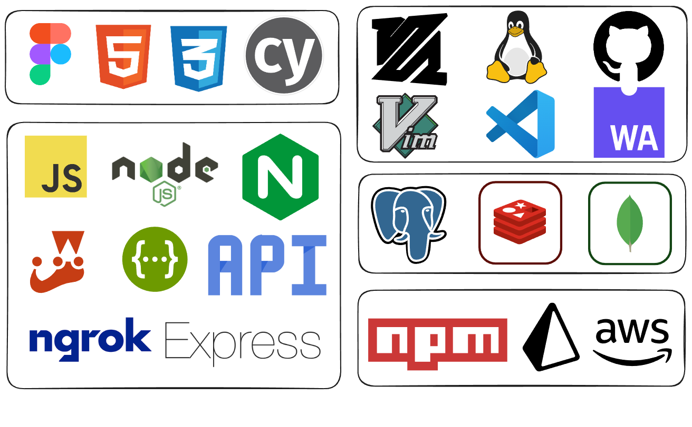

# FLUX - File Management Utility

A comprehensive file management utility designed for efficient storage, seamless file exploration, and versatile file manipulation.

## Key Features

- **Wide Range of Supported File Types:**
  - Text
  - PDFs
  - Images
  - Audio
  - Videos

- **File Storage and In-Browser File Explorer:**
  - Store files on the backend server
  - Image Viewer, Document, Text, PDF Viewer
  - Audio/Video Player
  - Storage Usage Display

- **File Format Conversion:**
  - Convert between different formats
  - Images: png ↔ jpg ↔ gif ↔ Heic
  - Videos: mp4 ↔ mk4 ↔ Heiv
  - Text/Document: markdown ↔ PDF

- **File Compression:**
  - Compress files to save storage space
  - Set default compression algorithm/level
  - One-off file compressor tool for unauthorized users

- **File Sharing:**
  - Drag and drop for instant shareable link
  - Role-based sharing (Viewer/Editor/Transfer Owner)
  - One-off sharing for unauthorized users

- **End-to-End Encrypted Secure Access:**
  - Files encrypted on disk and in transit (HTTPS)
  - Owner or shared access for content viewing

- **In-Browser File Editor:**
  - General Features: Format changer, Compressor
  - Images: resize, crop, blur, filters
  - Videos: crop, audio change, blur, cut, resize, transitions, rotate, merge, overlays, text, speed change
  - Text/PDF: Edit, export, compress, merge, export markdown with LaTeX template, watermark

- **User Management:**
  - Multiple User Roles: Superadmin, Admin, Staff, User, Unregistered User
  - Account and Security: Login with Google, GitHub, Twitter, LinkedIn; Email and password login; Password recovery mechanism

- **Pricing and Payment Gateway Integration:**
  - Set pricing for storage and compute quotas
  - Multiple pricing tiers
  - Easy payment for more features

## Tech Stack

## Usage

- [ ] To Be Added Later

## Development

The client and server are two different packages, with 100% independence.
They are in the same repo just to follow mono repo pattern,
cd into your respective directory to work on it.

## Contributing

- TBD & Added Later

## License

This project is licensed under the {-------} license - see the [LICENSE.md](LICENSE.md) file for details.